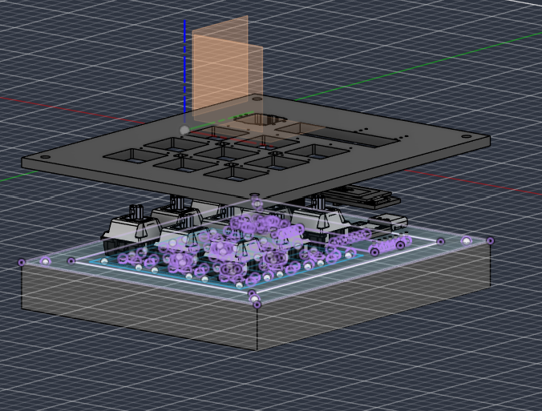

# HackPad1

HackPad1 is a custom 9-key macropad built using the Seeed XIAO RP2040. It includes a rotary encoder, a 128x32 OLED display, and per-key RGB lighting. The firmware is written using KMK, making it easy to customize key mappings and add new features.

This project was designed from scratch, including the PCB, enclosure, and firmware.

---

## Features

- 9-key mechanical macropad (3x3 layout)
- EC11 rotary encoder for volume control
- 128x32 OLED display
- Per-key RGB using SK6812MINI-E LEDs
- Powered by Seeed XIAO RP2040
- KMK firmware for easy customization
- Custom 2-piece 3D printed enclosure

---

## CAD Model

The enclosure is designed as a two-piece case.

- **Top Shell:** Holds the switches and has the outer frame.
- **Bottom Plate:** Closes the enclosure and supports the PCB.

### Overall View

### Case Assembly

---

## PCB

The PCB was designed in KiCad. It includes the switch matrix, rotary encoder, OLED display connections, RGB LEDs, and the XIAO RP2040.

### Schematic

### PCB Layout

---

## Firmware

The firmware is based on **KMK**.

Current functionality:

- Rotary encoder controls system volume.
- Pressing the encoder mutes/unmutes the audio.
- The 9 keys are currently mapped as number keys (1–9).
- OLED displays a startup message.

Key mappings can be easily changed by editing `main.py`.

---

## Bill of Materials (BOM)

| Component | Quantity |
|-----------|---------:|
| Cherry MX Switches | 9 |
| Keycaps | 9 |
| 1N4148 Diodes | 9 |
| SK6812MINI-E RGB LEDs | 9 |
| 0.91" 128x32 OLED Display | 1 |
| EC11 Rotary Encoder | 1 |
| Seeed XIAO RP2040 | 1 |
| 3D Printed Enclosure | 1 Set |
| M3 Screws *(update after final assembly)* | As Required |

---

## Future Improvements

- Add multiple layers and shortcuts
- OLED status indicators
- RGB lighting effects
- VIA/Vial-style configuration (if supported)
- Improve case design after testing the first prototype

---

## Acknowledgements

This project was built as part of the Hack Club HackPad initiative.

Special thanks to the Hack Club community for the resources and guidance throughout the build.